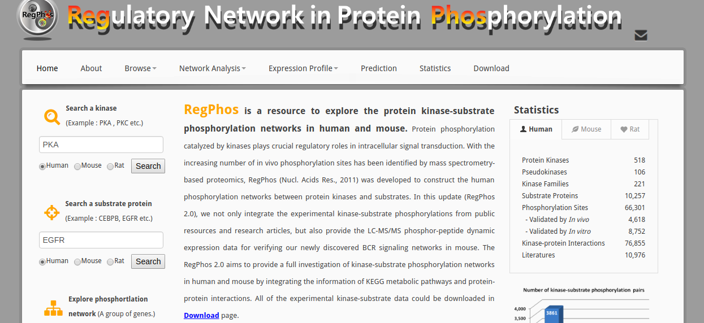
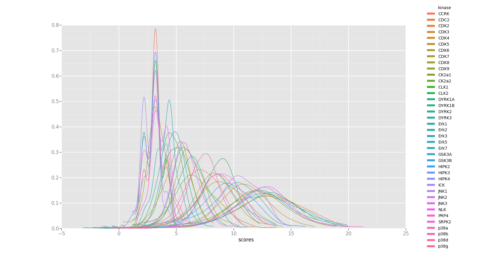
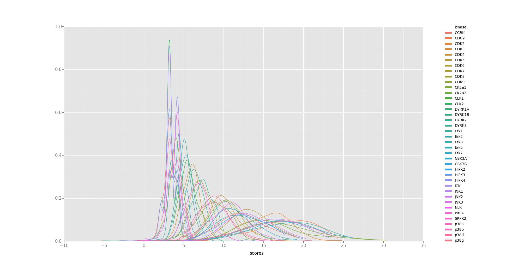

# Phosphorylation motif predictor

---

## Overview of the project

----

### 1. Given a list of phosphorylation sites

### 2. Get the known phosphorylation sites of a group of kinases

### 3. Know how similar is another set of proteins 

----



---

## Dependencies

----

#### Biopython

1. SeqIO Module - Fasta parsing
2. IUPAC Module - Implements "alphabets"
3. motifs Module - provides the "Motif" object

----

#### Other dependencies

1. Numpy - Numeric calculations
2. Pandas - provides object "DataFrame" 
3. ggplot2 - provides a nice plotting framework

---

## Project Structure

----

### `reg_phos_reader.py`

Program built from two smaller pandas dependant programs
- `get_kinase_group.py(source, group)`

Takes a database file and group name and returns a \nlist of the kinases that match given group.

- `get_substrates(db_source, kinase_list)`

Takes a database file and a list of uniprot ID's and
returns a nested DataFrame with the kinases as a column
and a data frame of data frames.

----

### `get_windows.py`

- `fill_sequence(sequence, length, fill_right, filler)`

Fills a string to match a length for instance 'A' for length 5 would be 'AXXXX'

- `get_windo_strings(entry, position, length)`

gets a string, a position and a length,
returns the character at given position,
and the window up and downstream of given length

- `get_windows(database, identifiers, positions, fill, length)`

----

### `calculate_allignment_scores.py`

Three functions used to calculate the aligment scores for strings and 
databases for single and multiple pssm's

- `_calculate_alignment_scores(pssm, sequence, m, n)`
- `calculate_alignment_scores(pssm, sequence)`
- `cross_score(pssms, fasta_database, start = None, end = None)`

---

## Usage Example

----

### Import all necesarry functions and packages

```
from reg_phos_reader import get_kinase_group, get_substrates
from get_windows import get_windows
from fasta_tools import get_relevant_db
from calculate_alignment_scores import cross_score

from Bio import SeqIO
from Bio.Alphabet import IUPAC
from Bio import motifs

import pandas as pd

from ggplot import *
```

----


```
my_kinases = get_kinase_group("./regPhos/RegPhos_kinase_human.txt",
                              "CMGC")
                              
In [3]: my_kinases[0:5]
Out[16]: 
['CCRK', 'CDC2', 'CDK2', 'CDK3', 'CDK10']
```

----


```
my_substrates = get_substrates("./regPhos/RegPhos_Phos_human.txt",
                               my_kinases)
In [17]: my_substrates[0:5]
Out[27]: 

  kinase                                         substrates
0   CCRK                ID      AC  position       descr...
1   CDC2                 ID      AC  position       desc...
2   CDK2                 ID      AC  position       desc...
3   CDK3                ID      AC  position    descript...
4  CDK10  Empty DataFrame
Columns: [ID, AC, position, de...
```

----


```
In [32]: my_substrates['substrates'][0]
Out[32]: 

              ID      AC  position       description catalytic kinase  \
2715  CDK2_HUMAN  P24941       160  Phosphothreonine             CCRK   

                                              reference            resource  \
2715  1396589;14597612;16325401;17095507;17192257;17...  Swiss-Prot 1010711   

     code  
2715    T  

```

----


```
my_windows = []

for i in (my_substrates['substrates'].tolist()):
    fasta_db = SeqIO.parse("./ModelOrganisms/UP000005640_9606.fasta",
                           "fasta", IUPAC.extended_protein)
    relevant_db = get_relevant_db(fasta_db, i['AC'])
    my_windows.append(
        get_windows(
            relevant_db,
            i['AC'],
            i['position']))
my_windows[1:5]
```

----

```
In [47]: my_windows[0:2]
Out[47]: 

[  aminoacid               upstream             downstream  \
 0       (T)  (G, V, P, V, R, T, Y)  (H, E, V, V, T, L, W)   
 
                                           window  
 0  (G, V, P, V, R, T, Y, T, H, E, V, V, T, L, W)  ,
     aminoacid               upstream             downstream  \
 0         (S)  (P, A, A, A, P, A, S)  (S, D, P, A, A, A, A)   
 1         (S)  (G, T, E, E, K, C, G)  (P, Q, V, R, T, L, S)   
 2         (S)  (P, I, P, I, M, P, A)  (P, Q, K, G, H, A, V)   
 3         (S)  (K, V, S, N, L, Q, V)  (P, K, S, E, D, I, S)   
 4         (T)  (S, A, A, S, N, T, G)  (P, D, G, P, E, A, P)   
 5         (S)  (D, F, I, D, A, F, A)  (P, V, E, A, E, G, T)   
 6         (T)  (L, T, R, Y, T, R, P)  (P, V, Q, K, H, A, I)   
 7         (T)  (G, C, H, L, L, V, A)  (P, G, R, L, V, D, M)   
 8         (S)  (I, Q, S, N, L, D, F)  (P, V, N, S, A, S, S)   
 9         (S)  (G, V, T, R, S, A, S)  (P, R, L, S, S, S, L)   
 10        (S)  (P, Q, G, Q, Q, P, L)  (P, Q, S, G, S, P, Q)   
```

----

```
my_motifs = [[] if len(window['window']) == 0 else
             motifs.create(window['window']) for
             window in my_windows]
```

----

```
In [63]: my_motifs[1].consensus
Out[63]: 
Seq('SGGSSPSSPVKPSPP', ExtendedIUPACProtein())

```


----


```
my_pwm = [[] if (len(m) == 0) else m.counts.normalize(pseudocounts=1) for
          m in my_motifs]
          
In [64]: my_pwm[1]
Out[64]: 

{'A': (0.05851063829787234,
  0.07446808510638298,
  0.05851063829787234,
  0.0425531914893617,
  0.05319148936170213,
  0.0797872340425532,
  
  ...
  
 'Y': (0.026595744680851064,
  0.02127659574468085,
  0.03723404255319149,
  0.02127659574468085,
  0.026595744680851064,
  
  ...
}  
  
```

----


```
In [65]: my_pssm[1]
Out[66]: 

{'A': [0.605282485100752,
  0.9532057885210588,
  0.605282485100752,
  0.14585086646345455,
  0.467778961350817,
  1.0527414620719733,

...

 'Y': [-0.532221038649183,
  -0.8541491335365455,
  -0.046794211478941264,
  -0.8541491335365455,
  -0.532221038649183,
  -1.2691866328153893,
  -1.2691866328153893,
  
  ...
}

```


----


```
model= "./ModelOrganisms/UP000000625_83333.fasta"

score_lists=cross_score(my_pssm, model, start=1, end=100)

score_lists[0].head()["scores"]

In [67]: score_lists[0]
Out[70]: 

      scores                     id
0   2.183283   sp|P0AB43|YCGL_ECOLI
1   3.183283   sp|P33644|YFIH_ECOLI
2   2.183283   sp|P76656|YQII_ECOLI
3   2.183283   sp|P46887|YECH_ECOLI
4   3.183283   sp|P00452|RIR1_ECOLI

....

```


----


```
my_data_frame = pd.DataFrame()
my_data_frame['kinase'] = [None if isinstance(i, list) else
                           str(i) for i in  my_kinases]
my_data_frame['matches'] = [None if isinstance(i, list) else
                           i for i in score_lists]
In [76]: my_data_frame.head()
Out[79]: 

  kinase                                            matches
0   CCRK        scores                     id
0   2.1832...
1   CDC2         scores                     id
0    8.32...
2   CDK2         scores                     id
0   10.20...
3   CDK3        scores                     id
0   5.2218...
4  CDK10     scores                     id
0    None   s...
```

----


```
In [88]: my_data_frame['matches'][0]
Out[88]: 

      scores                     id
0   2.183283   sp|P0AB43|YCGL_ECOLI
1   3.183283   sp|P33644|YFIH_ECOLI
2   2.183283   sp|P76656|YQII_ECOLI
3   2.183283   sp|P46887|YECH_ECOLI
4   3.183283   sp|P00452|RIR1_ECOLI
5   3.183283   sp|P75933|FLGA_ECOLI
```

----


```

In [89]: concat.head()
Out[90]: 

  kinase    scores                    id
0   CCRK  2.183283  sp|P0AB43|YCGL_ECOLI
1   CCRK  3.183283  sp|P33644|YFIH_ECOLI
2   CCRK  2.183283  sp|P76656|YQII_ECOLI
3   CCRK  2.183283  sp|P46887|YECH_ECOLI
4   CCRK  3.183283  sp|P00452|RIR1_ECOLI

```

----


```
concat = pd.concat(my_data_frame['matches'].tolist(),
                   keys = my_data_frame['kinase'])
concat.reset_index(level=0, inplace=True)
concat = concat[concat['scores'].notnull()]
```

----


```
ggplot(concat, aes(x = 'scores', color = 'kinase'), norm=True) + geom_density()
```

---



----




----
