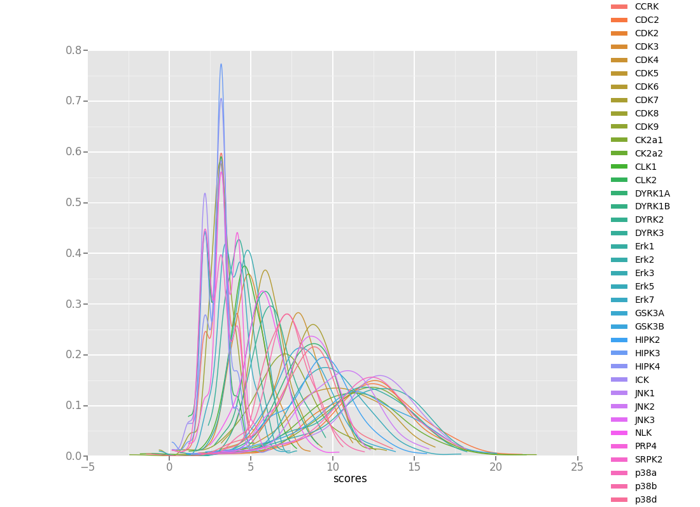

# Phosphorylation motif finder

---

## Overview of the project

----

### 1. Given a list of phosphorylation sites

### 2. Get the known phosphorylation sites of a group of kinases

### 3. Know how similar is another set of proteins 

----


---

## Dependencies

----

#### Biopython

1. SeqIO Module - Fasta parsing
2. IUPAC Module - Implements "alphabets"
3. motifs Module - provides the "Motif" object

----

#### Other dependencies

1. Numpy - Numeric calculations
2. Pandas - provides object "DataFrame" 
3. ggplot2 - provides a nice plotting framework

---

## Project Structure

----

Here goes a super cool image of the dependency-tree

----

#### reg\_phos\_reader.py

Program built from two smaller pandas dependant programs
- get_kinase_group.py(source, group)
--Takes a database file and group name and returns a \nlist of the kinases that match given group.

- get_substrates(db_source, kinase_list)
--Takes a database file and a list of uniprot ID's and
returns a nested DataFrame with the kinases as a column
and a data frame of data frames.
----

#### get_windows.py
Three smaller programs built upon each other
- fill_sequence(sequence, length, fill_right, filler)
-- Fills a string to match a length for instance 'A' for length 5 would be 'AXXXX'

- get_window_strings(entry, position, length)
-- gets a string, a position and a length,
    returns the character at given position,
    and the window up and downstream of given length

- get_windows(database, identifiers, positions, fill, length)
-- Generate a list with only the entries that match any of our IDs, INTO MEMMORY!

----

#### calculate_allignment_scores.py
Three functions used to calculate the aligment scores and cross score of a sequence

- _calculate_alignment_scores(pssm, sequence, m, n)

- calculate_alignment_scores(pssm, sequence)

- cross_score(pssms, fasta_database, start = None, end = None)

----

## Project Walkthrough

----

#### usage_example.py
```
import all necesarry functions and packages
from reg_phos_reader import get_kinase_group, get_substrates
from get_windows import get_windows
from fasta_tools import get_relevant_db
from calculate_alignment_scores import cross_score

from Bio import SeqIO
from Bio.Alphabet import IUPAC
from Bio import motifs

import pandas as pd

from ggplot import *
```

----
````
my_kinases = get_kinase_group("./regPhos/RegPhos_kinase_human.txt",
                              "CMGC")
my_kinases[1:10]
````
```
- ['CDC2', 'CDK2', 'CDK3', 'CDK10', 'CDK4', 'CDK6', 'CDK5', 'CDK7', 'CDK8']
```

----
````
my_substrates = get_substrates("./regPhos/RegPhos_Phos_human.txt",
                               my_kinases)
my_substrates[1:10]
````
```
- kinase                                         substrates
- 1   CDC2                 ID      AC  position       desc...
- 2   CDK2                 ID      AC  position       desc...
- 3   CDK3                ID      AC  position    descript...
- 4  CDK10  Empty DataFrame
- Columns: [ID, AC, position, de...
- 5   CDK4                 ID      AC  position       desc...
- 6   CDK6                ID      AC  position       descr...
- 7   CDK5                 ID      AC  position       desc...
- 8   CDK7                 ID      AC  position       desc...
- 9   CDK8                ID      AC  position    descript...
```

----
````
my_windows = []

for i in (my_substrates['substrates'].tolist()):
    fasta_db = SeqIO.parse("./ModelOrganisms/UP000005640_9606.fasta",
                           "fasta", IUPAC.extended_protein)
    relevant_db = get_relevant_db(fasta_db, i['AC'])
    my_windows.append(
        get_windows(
            relevant_db,
            i['AC'],
            i['position']))
my_windows[1:5]
````
```
- [68 rows x 4 columns],   aminoacid               upstream             downstream  \
- 0       (S)  (P, G, G, N, I, Y, I)  (P, L, K, S, P, Y, K)   
- 1       (S)  (I, Y, I, S, P, L, K)  (P, Y, K, I, S, E, G)   
- 2       (S)  (G, I, L, A, R, R, P)  (Y, R, K, I, L, K, D)   
- 
-                                           window  
- 0  (P, G, G, N, I, Y, I, S, P, L, K, S, P, Y, K)  
- 1  (I, Y, I, S, P, L, K, S, P, Y, K, I, S, E, G)  
- 2  (G, I, L, A, R, R, P, S, Y, R, K, I, L, K, D)  , Empty DataFrame
- Columns: [aminoacid, upstream, downstream, window]
- Index: []]
```

----
````
my_motifs = [[] if len(window['window']) == 0 else
             motifs.create(window['window']) for
             window in my_windows]
````
----
````
my_pwm = [[] if (len(m) == 0) else m.counts.normalize(pseudocounts=1) for
          m in my_motifs]
````
----
````
model= "./ModelOrganisms/UP000000625_83333.fasta"

score_lists=cross_score(my_pssm, model, start=1, end=100)

score_lists[0].head()["scores"]
````
```
- 0    4.183283
- 1    3.183283
- 2    4.183283
- 3    4.183283
- 4    3.183283
```

````
score_lists[0].head()["id"]
````
```
- 0    sp|P10903|NARK_ECOLI
- 1    sp|P45761|GSPJ_ECOLI
- 2    sp|P76157|YNFN_ECOLI
- 3    sp|Q46898|CAS5_ECOLI
- 4    sp|P16700|CYSP_ECOLI
```
----
````
my_data_frame = pd.DataFrame()
my_data_frame['kinase'] = [None if isinstance(i, list) else
                           str(i) for i in  my_kinases]
my_data_frame['matches'] = [None if isinstance(i, list) else
                           i for i in score_lists]
````
----
````
concat = pd.concat(my_data_frame['matches'].tolist(),
                   keys = my_data_frame['kinase'])
concat.reset_index(level=0, inplace=True)
concat = concat[concat['scores'].notnull()]
````
----
````
ggplot(concat, aes(x = 'scores', color = 'kinase'), norm=True) + geom_density()
````

----